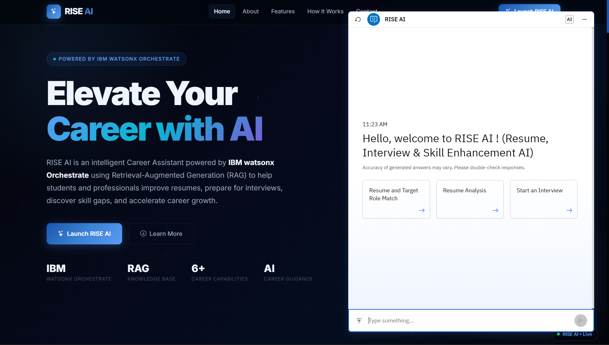
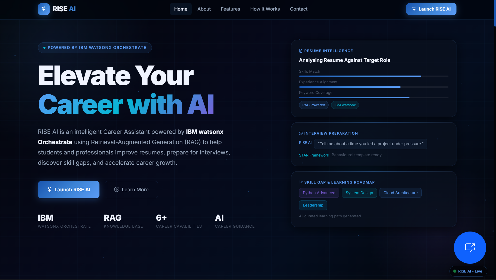
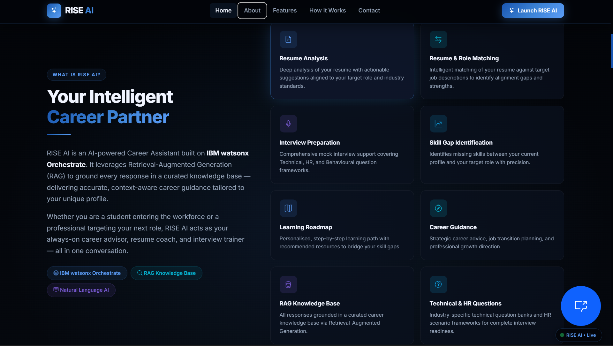
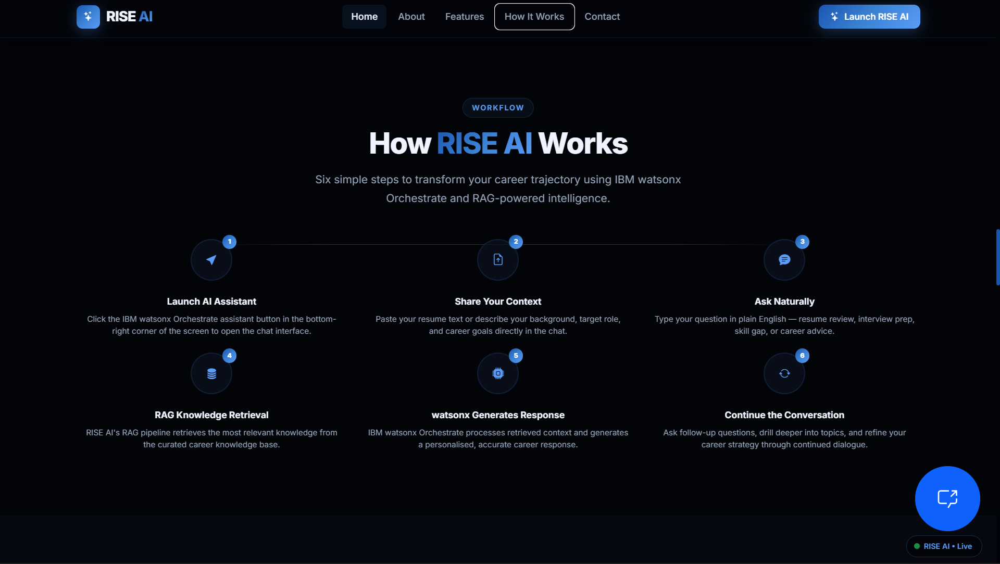

# 🚀 RISE AI — Resume, Interview & Skill Enhancement AI

> **An AI-powered career assistant built with IBM watsonx Orchestrate, Retrieval-Augmented Generation (RAG), Python Flask, and IBM BOB.**

## 🌐 Live Demo

**https://rise-ai-pm3b.onrender.com/**

---

# 📖 Overview

RISE AI is an AI-powered career assistance platform designed to help students and job seekers prepare for placements and interviews through intelligent AI conversations.

The application provides a modern web interface integrated with an embedded IBM watsonx Orchestrate AI agent. Using Retrieval-Augmented Generation (RAG), the assistant retrieves relevant information from a curated knowledge base to provide accurate and contextual career guidance.

The project was developed as part of the **IBM SkillsBuild Internship** using **IBM watsonx Orchestrate**.

---

# ✨ Key Features

- 📄 Resume Analysis
- 🎯 Resume–Target Role Match Guidance
- 💼 Interview Preparation
- ❓ Technical & HR Interview Assistance
- 🧠 AI-powered Career Question Answering
- 📚 Retrieval-Augmented Generation (RAG)
- 🤖 IBM watsonx Orchestrate Embedded AI Assistant
- 🌐 Responsive Modern Web Interface

---

# 📷 Screenshots

> Add screenshots inside a `screenshots` folder.

### RISE AI



### Home Page



### About Section



### How It Works



### AI Assistant


---

# 🏗️ Project Structure

```text
rise-ai/
│
├── app.py
├── requirements.txt
├── Procfile
│
├── templates/
│   ├── base.html
│   ├── index.html
│   └── contact.html
│
├── static/
│   ├── css/
│   │      style.css
│   ├── js/
│   │      main.js
│   └── images/
│
└── README.md
```

---

# ⚙️ Application Workflow

```text
                User
                  │
                  ▼
        Flask Web Application
                  │
                  ▼
      IBM watsonx Orchestrate Agent
                  │
                  ▼
        RAG Knowledge Base
                  │
                  ▼
        AI-generated Response
                  │
                  ▼
     Embedded AI Assistant Widget
```

---

# 🏛️ System Architecture

```text
             +----------------------+
             |      User            |
             +----------+-----------+
                        |
                        |
                        ▼
            +-----------------------+
            | Flask Web Application |
            +----------+------------+
                       |
                       ▼
      +------------------------------------+
      | IBM watsonx Orchestrate AI Agent   |
      +----------------+-------------------+
                       |
                       ▼
       +-----------------------------------+
       | RAG Knowledge Base                |
       +----------------+------------------+
                        |
                        ▼
             AI Generated Response
```

---

# 🧩 Home Page Sections

| Section | Description |
|----------|-------------|
| Hero | Introduction with CTA and IBM watsonx branding |
| About | Overview of RISE AI |
| Features | Core AI capabilities |
| How It Works | Six-step application workflow |
| Technology | Technologies used |
| Why Choose RISE AI | Key advantages |
| AI Assistant | Embedded IBM watsonx Orchestrate chatbot |
| Architecture | System architecture diagram |
| Footer | Links and project information |

---

# 🤖 IBM watsonx Orchestrate Integration

The embedded AI assistant is integrated inside:

```
templates/base.html
```

Locate the placeholder:

```html
<!-- IBM watsonx Orchestrate Embedded Agent -->

Paste IBM watsonx Orchestrate Embedded Script Here

<!-- End IBM watsonx Orchestrate Embedded Agent -->
```

The chatbot widget size can be customized inside:

```css
static/css/style.css
```

```css
:root{
    --wxo-float-width:620px;
    --wxo-float-height:900px;
}
```

---

# 💻 Technologies Used

| Category | Technology |
|------------|------------------------------|
| AI Platform | IBM watsonx Orchestrate |
| Knowledge Retrieval | Retrieval-Augmented Generation (RAG) |
| Backend | Python 3.11 |
| Framework | Flask |
| Frontend | HTML5 |
| Styling | CSS3 |
| UI Framework | Bootstrap 5 |
| JavaScript | Vanilla JavaScript |
| Templates | Jinja2 |
| Icons | Bootstrap Icons |
| Fonts | Google Fonts (Inter) |
| Frontend Development | IBM BOB AI Assistant |

---

# 🚀 Installation

## Clone Repository

```bash
git clone https://github.com/Abhinav00010/RISE-AI.git

cd RISE-AI
```

---

## Create Virtual Environment

Windows

```bash
python -m venv venv

venv\Scripts\activate
```

Linux / macOS

```bash
python3 -m venv venv

source venv/bin/activate
```

---

## Install Dependencies

```bash
pip install -r requirements.txt
```

---

## Run Application

```bash
python app.py
```

Open

```
http://localhost:5000
```

---

# ☁️ Deployment

The application is deployed on **Render**.

Production Server

```bash
gunicorn app:app
```

---

# 📚 Knowledge Base

RISE AI uses a Retrieval-Augmented Generation (RAG) knowledge base connected to IBM watsonx Orchestrate.

The knowledge base enables contextual responses for:

- Resume Guidance
- Interview Preparation
- Career Advice
- Technical Questions
- HR Questions

---

# 🎨 Design Highlights

- Dark Futuristic Theme
- IBM-inspired Color Palette
- Responsive Layout
- Glassmorphism UI
- Animated Components
- Scroll Reveal Effects
- Floating Cards
- Modern Typography
- Interactive Hover Animations

---

# 🔮 Future Enhancements

- Resume PDF Upload
- ATS Compatibility Analysis
- Personalized Career Roadmaps
- User Authentication
- Dashboard
- Progress Tracking
- Mock Interview Analytics

---

# 👨‍💻 Developed For

**IBM SkillsBuild Internship Project**

Using

- IBM watsonx Orchestrate
- IBM RAG Knowledge Base
- Python Flask
- IBM BOB AI Assistant

---

# 📄 License

This project is licensed under the MIT License.

---

# ⭐ Support

If you found this project useful, consider giving it a ⭐ on GitHub.